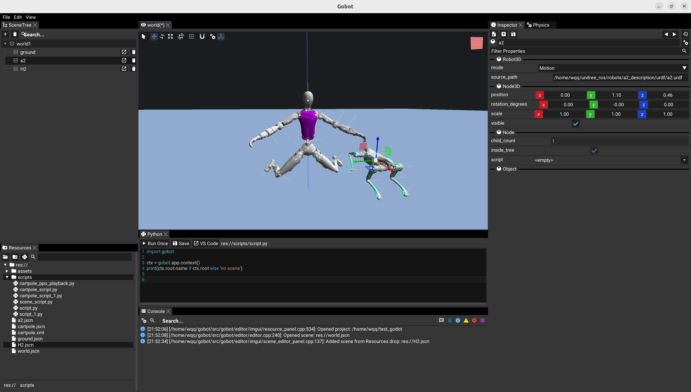

# gobot
Go, robot go!



[](https://github.com/RobSimulatorGroup/gobot/blob/master/LICENSE)
[](https://github.com/RobSimulatorGroup/gobot/actions)

## Supported Platforms

Linux only.

## Requirements

CMake 3.16+ and GCC with C++20 support.

Install system dependencies:
```shell
sudo apt update && sudo apt install -y \
  cmake build-essential \
  libeigen3-dev nlohmann-json3-dev libspdlog-dev libpng-dev \
  libx11-xcb-dev libfontenc-dev libice-dev libsm-dev libxaw7-dev \
  libxcomposite-dev libxcursor-dev libxdamage-dev libxext-dev \
  libxfixes-dev libxi-dev libxinerama-dev libxkbfile-dev libxmu-dev \
  libxmuu-dev libxpm-dev libxrandr-dev libxrender-dev libxres-dev \
  libxss-dev libxt-dev libxtst-dev libxv-dev libxvmc-dev libxxf86vm-dev \
  libxcb-render0-dev libxcb-render-util0-dev libxcb-xkb-dev \
  libxcb-icccm4-dev libxcb-image0-dev libxcb-keysyms1-dev \
  libxcb-randr0-dev libxcb-shape0-dev libxcb-sync-dev libxcb-xfixes0-dev \
  libxcb-xinerama0-dev libxcb-dri3-dev uuid-dev libxcb-util-dev \
  autoconf libgl-dev
```

## Getting started

```shell
git clone https://github.com/RobSimulatorGroup/gobot.git
cd gobot
git submodule update --recursive --init
mkdir build && cd build
cmake -DCMAKE_BUILD_TYPE=Release ..
make -j$(nproc)
```

## Python Bindings

Gobot builds a `gobot` CPython extension with pybind11 when
`GOB_BUILD_PYTHON_BINDINGS` is enabled. The default CMake configuration enables
it.

Build the module:

```bash
cmake -S . -B build -DCMAKE_BUILD_TYPE=Release
cmake --build build --target gobot_python -j$(nproc)
```

Use the build tree directly:

```bash
PYTHONPATH="$PWD/build/python" python3 - <<'PY'
import gobot

print(gobot.__file__)
print(gobot.backend_infos())
PY
```

Run the Python smoke test:

```bash
PYTHONPATH="$PWD/build/python" python3 tests/python/test_python_bindings_smoke.py
```

Run a real-scene smoke test when you have a Gobot project containing
`world.jscn` and robot assets:

```bash
PYTHONPATH="$PWD/build/python" python3 tests/python/smoke_real_scene.py \
  --project /path/to/project \
  --scene res://world.jscn \
  --robot H2 \
  --backend mujoco \
  --steps 4
```

The Python API uses the same `res://` project root as the editor:

```python
import gobot

gobot.set_project_path("/path/to/project")
scene = gobot.load_scene("res://world.jscn")
env = gobot.RLEnvironment("res://world.jscn", robot="H2", backend="mujoco")
observation, info = env.reset(seed=1)
```

### RL And PPO Smoke

The Python layer includes a small Gymnasium-style adapter. The PPO trainer lives
in the separate `RobSimulatorGroup/ppo` repository so Gobot can stay focused on
engine, scene, simulation, and bindings.

Check the environment spaces:

```bash
PYTHONPATH="$PWD/build/python" python3 - <<'PY'
import gobot
from gobot_gym_adapter import GobotGymEnv

gobot.set_project_path("/home/wqq/test_godot")
env = GobotGymEnv("res://world.jscn", robot="H2", backend="mujoco")
obs, info = env.reset(seed=1)
print(info)
print(env.observation_space.shape, env.action_space.shape)
PY
```

Run PPO from the trainer repository:

```bash
cd /home/wqq/ppo
GOBOT_PYTHONPATH=/home/wqq/gobot/build_ppo/python uv run gobot-ppo \
  --project /home/wqq/test_godot \
  --scene res://world.jscn \
  --robot H2 \
  --backend mujoco \
  --total-steps 4096 \
  --rollout-steps 256
```

The boundary is intentional: C++ owns deterministic reset, fixed-step
simulation, normalized joint-position actions, previous-action observations, and
configurable reward terms; the PPO repository owns the training loop.

### Editable Install

The repository includes a minimal `pyproject.toml` for local Python installs:

```bash
python3 -m pip install -e .
```

This requires `scikit-build-core` in the Python build environment. On Ubuntu,
install `python3-venv` first if you want to test in a clean virtual
environment:

```bash
sudo apt install python3-venv
python3 -m venv .venv
. .venv/bin/activate
python -m pip install -U pip scikit-build-core
python -m pip install -e .
```

The install rules place `gobot.cpython-*.so`, `libgobot.so`,
`librttr_core.so.*`, optional MuJoCo runtime libraries, and
`gobot_gym_adapter.py` together with `$ORIGIN` rpath, so an installed module
does not need `LD_LIBRARY_PATH` for these local Gobot libraries.

Do not add a `python/gobot/__init__.py` package around the current extension
module unless the extension is renamed to something like `gobot._gobot`; a
package directory named `gobot` can shadow `gobot.cpython-*.so`.

## MuJoCo Backend Setup

Gobot keeps MuJoCo optional. The default build does not download or link MuJoCo,
so editor and tests can still build on machines without the SDK.

### Recommended: Local MuJoCo SDK

Download a MuJoCo release from the official `google-deepmind/mujoco` GitHub
releases page and extract it somewhere outside the Gobot source tree.

Configure Gobot with the extracted SDK root:

```bash
cmake -S . -B build \
  -DGOB_BUILD_MUJOCO=ON \
  -DGOB_MUJOCO_ROOT=/path/to/mujoco
```

`GOB_MUJOCO_ROOT` may point either to a CMake install prefix containing
`mujocoConfig.cmake`, or to the extracted SDK layout containing `include/` and
`lib/` or `bin/`.

If MuJoCo was installed into a normal CMake prefix, this also works:

```bash
cmake -S . -B build \
  -DGOB_BUILD_MUJOCO=ON \
  -DCMAKE_PREFIX_PATH=/path/to/mujoco
```

### Optional: Fetch MuJoCo During Configure

For a one-command source build, allow CMake to fetch the pinned official release:

```bash
cmake -S . -B build \
  -DGOB_BUILD_MUJOCO=ON \
  -DGOB_FETCH_MUJOCO=ON
```

The fetched release is controlled by:

```bash
-DGOB_MUJOCO_GIT_TAG=3.8.0
```

This path is intentionally opt-in because MuJoCo's own CMake build uses
`FetchContent` for dependencies. It may be slow or fail on restricted networks.

### Not Using A Submodule Yet

MuJoCo is not added as a default git submodule because most Gobot builds do not
need to compile a physics backend, and a source checkout still needs additional
network downloads for MuJoCo dependencies. Keeping MuJoCo as an optional package
or opt-in fetch keeps the base editor clone smaller and easier to build.

### Runtime Notes

When linking against a dynamic SDK library, make sure the MuJoCo shared library
is visible at runtime, for example:

```bash
export LD_LIBRARY_PATH=/path/to/mujoco/lib:$LD_LIBRARY_PATH
```

The Gobot MuJoCo backend currently loads the first `Robot3D.source_path` as a
MuJoCo XML model through `mj_loadXML`. URDF support therefore follows MuJoCo's
compiler behavior, and advanced Gobot scene-to-MJCF export remains a later step.

### Editor Smoke Test

The first editor-level check is that MuJoCo is actually selected and stepping:

1. Load or import a robot scene.
2. Open the `Physics` panel.
3. Select `MuJoCo CPU`.
4. Check that the backend reports `Available`.
5. Click `Build World`.
6. Click `Step` and watch the frame counter and joint state table.

If the frame counter advances and joint positions/velocities are populated, the
Gobot editor is creating a MuJoCo world and calling `mj_step`.

Visible falling/contact behavior needs extra scene conditions:

- The MuJoCo model must contain a ground plane or floor geom.
- The robot root must be free/floating if gravity should move the base.
- A fixed-base robot with no control targets may look unchanged even while
  MuJoCo is stepping correctly.
