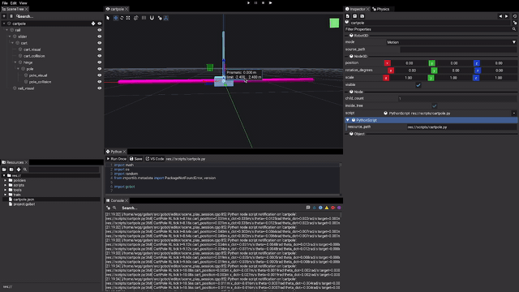
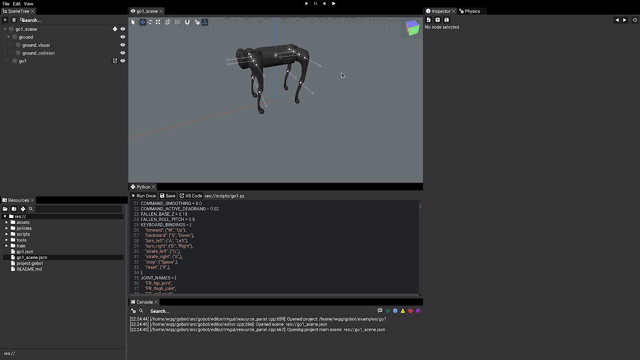

# gobot

Gobot is a Linux robotics simulation package with a Python-first workflow.
Use it from Python to create scenes, step simulation, inspect robot state, and
drive reinforcement-learning experiments.


[](https://pypi.org/project/gobot/)
[](https://github.com/RobSimulatorGroup/gobot/blob/master/LICENSE)
[](https://github.com/RobSimulatorGroup/gobot/actions)

## Install

Gobot currently publishes Linux wheels.

```bash
pip install gobot -i https://pypi.org/simple
```

Check the install:

```python
import gobot

print(gobot.__file__)
print(gobot.__version__)
print(gobot.backend_infos())
```

## Python Usage

Set a project root before using `res://` paths:

```python
import gobot

gobot.set_project_path("/path/to/project")
scene = gobot.load_scene("res://world.jscn")

print(scene.root.name)
```

## Editor

Start the editor from the Python environment you want Gobot to use:

```bash
gobot_editor
```

For source checkout development:

```bash
cd /path/to/gobot
uv sync --extra train
uv run gobot_editor --path examples/go1
```

`uv sync` installs Gobot editable: Python files import directly from the
checkout, while `_core`, `libgobot`, and `gobot_editor` come from the same
build installed in `.venv`. After changing C++ or CMake files, rebuild and
reinstall only Gobot:

```bash
uv sync --extra train --reinstall-package gobot --no-build-isolation-package gobot
```

The initial `uv sync` installs the build backend in `.venv`; disabling build
isolation on later native rebuilds prevents CMake from caching a temporary
build environment's Python executable.

Python-only edits need no rebuild. Do not add `PYTHONPATH` or launch an editor
from `build/python`; that can combine source files, native extensions, and
executables from different builds. The package launcher selects the native
artifacts installed in its own environment.

`uv run` is environment activation, not a separate Gobot runtime. These are
equivalent after `uv sync`:

```bash
uv run gobot_editor --path examples/go1
.venv/bin/gobot_editor --path examples/go1
```

Alternatively, run `source .venv/bin/activate` once and then use
`gobot_editor` or `python` directly. At runtime,
`GOBOT_PYTHON_LIBRARY=/other/libpython.so` still overrides automatic
libpython discovery.

For a standalone CMake build used by C++ tests, use a separate build directory
and the Python selected by `uv`:

```bash
cmake -S . -B build/dev -DPython3_EXECUTABLE="$(uv python find)"
cmake --build build/dev -j
```

That standalone build is not the artifact used by the `.venv` console script;
run the following command when the installed editor must be updated:

```bash
uv sync --extra train --reinstall-package gobot --no-build-isolation-package gobot
```

The default install includes the lightweight ONNX Runtime path used for example
policy playback. The heavier training stack stays optional:

```bash
uv sync --extra train
```

`train` installs PyTorch, `rsl-rl-lib`, `tensordict`, and `tensorboard` for
training or directly loading `.pt` checkpoints. It does not install Python
`mujoco`; Gobot uses its packaged native MuJoCo backend. Install
`imageio imageio-ffmpeg` only for MP4 training captures, and `onnx>=1.16` only
for exporting checkpoints to ONNX.

Run example training through `uv` rather than a conda Python path:

```bash
uv run --extra train python examples/go1/train/go1_velocity_train.py --num-envs 256 --iterations 1500
```

Packaged examples are available from the editor start screen under `Examples`.
See `doc/examples.md` for packaging details.

## Examples

| Example | Preview |
| --- | --- |
| CartPole |  |
| Go1 policy playback |  |

## Local Wheel Build

From a source checkout:

```bash
git clone https://github.com/RobSimulatorGroup/gobot.git
cd gobot
git submodule update --init --recursive
uv run --with build python -m build --wheel
uv pip install --force-reinstall dist/gobot-*.whl
```

## Notes

- Supported platform: Linux.
- Python package name: `gobot`.
- MuJoCo support is included in release wheels when available in the build.
- Packaged examples: `gobot/examples/` in wheels and `examples/` in source.
- MuJoCo RL roadmap: `doc/mujoco_rl_plan.md`.
