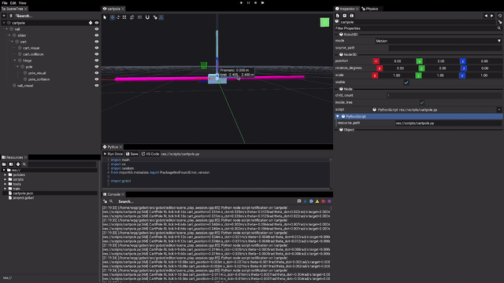
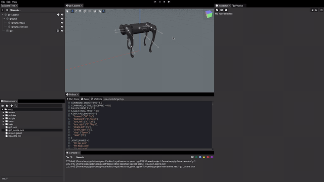

# gobot

Gobot is a Linux robotics simulation package with a Python-first workflow.
Use it from Python to create scenes, step simulation, inspect robot state, and
drive reinforcement-learning experiments.


[](https://pypi.org/project/gobot/)
[](https://github.com/RobSimulatorGroup/gobot/blob/master/LICENSE)
[](https://github.com/RobSimulatorGroup/gobot/actions)

## Install

Gobot publishes full-featured Linux x86_64 wheels for NVIDIA GPU systems.
The default install includes CPU simulation, MuJoCo Warp, Newton, PyTorch and
CUDA user-space dependencies, the LuisaCompute renderer, Gaussian Splatting
inference, and the bundled OpenUSD importer/runtime. There are no feature extras
to select.

```bash
pip install gobot -i https://pypi.org/simple
```

Check the install:

```python
import gobot

print(gobot.__file__)
print(gobot.__version__)
print(gobot.backend_infos())
```

## Python Usage

Set a project root before using `res://` paths:

```python
import gobot

gobot.set_project_path("/path/to/project")
scene = gobot.load_scene("res://world.jscn")

print(scene.root.name)
```

## Editor

Start the editor from the Python environment you want Gobot to use:

```bash
gobot_editor
```

For source checkout development:

```bash
cd /path/to/gobot
uv run gobot_editor --path examples/go1
```

The first `uv run` initializes the required Git submodules and builds the
cached LuisaCompute, gsplat, and OpenUSD SDKs before installing Gobot editable.
It requires the source-build toolchain, including a CUDA toolkit with `nvcc`.
Later runs are incremental. Python files import directly from the checkout,
while `_core`, `libgobot`, and `gobot_editor` come from the same build installed
in `.venv`. The editable `gobot_editor` launcher runs an incremental CMake/Ninja
rebuild before every start, so changed C++ and CMake files cannot silently leave
the editor on stale native binaries. If the initial editable install was
configured inside uv's temporary build isolation environment, the launcher
repairs that persistent CMake cache with the current virtual environment before
its first incremental rebuild.

When native changes must be used by another Python entry point, rebuild and
reinstall only Gobot explicitly:

```bash
uv sync --reinstall-package gobot --no-build-isolation-package gobot
```

The initial `uv sync` installs the build backend in `.venv`; disabling build
isolation on later native rebuilds prevents CMake from caching a temporary
build environment's Python executable.

Python-only edits need no rebuild. Do not add `PYTHONPATH` or launch an editor
from `build/python`; that can combine source files, native extensions, and
executables from different builds. The package launcher selects the native
artifacts installed in its own environment.

`uv run` is environment activation, not a separate Gobot runtime. These are
equivalent after `uv sync`:

```bash
uv run gobot_editor --path examples/go1
.venv/bin/gobot_editor --path examples/go1
```

Alternatively, run `source .venv/bin/activate` once and then use
`gobot_editor` or `python` directly. At runtime,
`GOBOT_PYTHON_LIBRARY=/other/libpython.so` still overrides automatic
libpython discovery.

For a standalone CMake build used by C++ tests, use a separate build directory
and the Python selected by `uv`:

```bash
cmake -S . -B build/dev -DPython3_EXECUTABLE="$(uv python find)"
cmake --build build/dev -j
ctest --test-dir build/dev --output-on-failure
```

Python CTest cases run against `build/dev/python` in an isolated interpreter,
so an older editable `_core` in `.venv` cannot shadow the artifact under test.
That standalone build is not the artifact used by the `.venv` console script;
run the following command when the installed editor must be updated:

```bash
uv sync --reinstall-package gobot --no-build-isolation-package gobot
```

The default Linux x86-64 environment includes ONNX Runtime, PyTorch, rsl_rl,
MuJoCo Warp, Newton, training logs, video capture, and ONNX export support.
There are no separate CPU, CUDA, or training extras. Selecting a simulation
provider remains explicit; requesting a CUDA provider never silently falls
back to CPU.

OpenUSD remains an optional CMake feature, but Python source builds enable it by
default. Official Linux x86-64 wheels bundle the runtime, so
`pip install gobot` does not need OpenUSD, LuisaCompute, or oneTBB checkouts and
does not compile them on the user's computer. Source builds use pinned, shallow
submodules under `3rdparty`; the PEP 517 backend initializes and builds them
automatically. The explicit CMake workflow remains available for SDK work:

```bash
git submodule update --init --depth=1 3rdparty/openusd 3rdparty/onetbb
cmake --workflow --preset dependencies-openusd
cmake -S . -B build/openusd-dev \
  -DGOB_BUILD_OPENUSD=ON \
  -DGOB_OPENUSD_ROOT="$PWD/build/openusd/install"
cmake --build build/openusd-dev -j
```

The importer maps USD hierarchy, stage units/up-axis, transforms, visibility,
render-purpose polygon meshes, normals, UVs, and constant `UsdPreviewSurface`
material inputs into Gobot `PackedScene` data. OpenUSD-enabled installs bundle
their native runtime under `gobot/openusd`. See
[Newton and OpenUSD integration](doc/newton_openusd.md) for the data boundary
and provider example.

Run the Gobot-rendered Newton G1 policy example through `uv`:

```bash
uv run gobot_editor --path examples/newton_g1
```

Its project hook downloads the pinned official structured USD and policy files,
verifies them, and caches the USD as one Gobot `Robot3D` scene before opening.

Run Go1 rough-terrain training on MuJoCo Warp through `uv`:

```bash
uv run \
  python -m examples.go1.train.go1_velocity_train \
  --backend mujoco-warp \
  --device cuda:0 \
  --num-envs 256 \
  --iterations 10000 \
  --no-step-extras
```

Select the CPU semantic baseline explicitly when CUDA is not desired:

```bash
uv run \
  python -m examples.go1.train.go1_velocity_train \
  --backend mujoco-cpu \
  --device cpu \
  --num-envs 64 \
  --iterations 10000
```

Packaged examples are available from the editor start screen under `Examples`.
See `doc/examples.md` for packaging details.

## Examples

| Example | Preview |
| --- | --- |
| CartPole |  |
| Go1 policy playback |  |

## Local Wheel Build

From a source checkout:

```bash
git clone https://github.com/RobSimulatorGroup/gobot.git
cd gobot
uv run --with build python -m build --wheel
uv pip install --force-reinstall dist/gobot-*.whl
```

The PEP 517 backend initializes the pinned submodules and incrementally builds
all native SDKs. A complete Git checkout is required for source builds; install
the published wheel when the dependency sources or native build toolchain are
not available.

## Notes

- Supported platform: Linux.
- Python package name: `gobot`.
- Release wheels install MuJoCo CPU, MuJoCo Warp, Newton, LuisaCompute,
  Gaussian Splatting inference, and OpenUSD support by default. The Python GPU
  providers remain behind Gobot's backend-neutral simulation boundary.
- A system CUDA Toolkit is needed to build from source, but not to use a wheel.
  Wheel users need a compatible NVIDIA driver providing `libcuda.so.1` and
  the system libglvnd EGL/OpenGL dispatch libraries. Driver libraries are not
  copied into the wheel because they must match the target machine's driver.
- Packaged examples: `gobot/examples/` in wheels and `examples/` in source.
- MuJoCo RL roadmap: `doc/mujoco_rl_plan.md`.
- Luisa CUDA renderer architecture and build guide: `doc/luisa_rendering_plan.md`.
- Gaussian Splatting environment assets and inference runtime: `doc/gaussian_splatting.md`.
