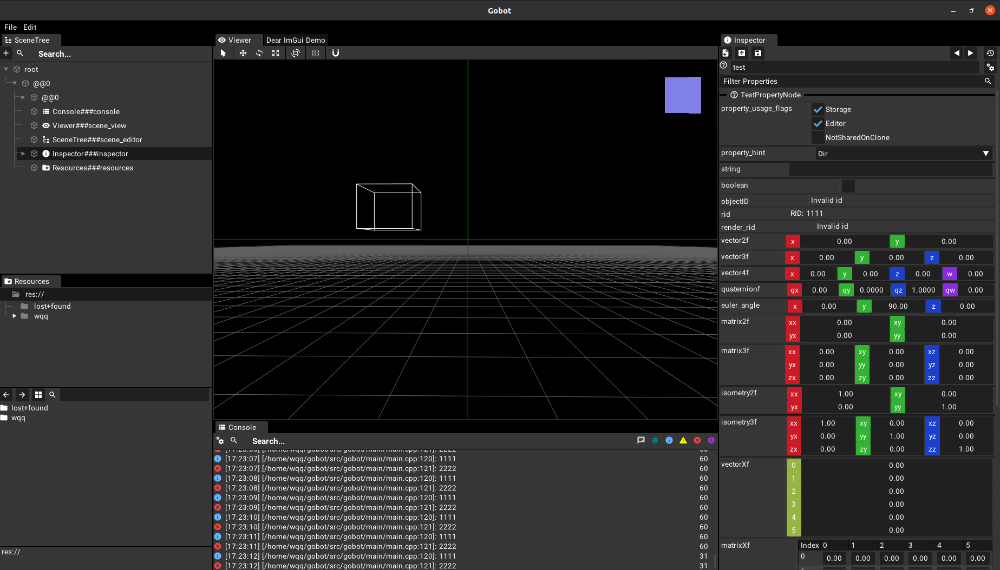

# gobot
Go, robot go! 



[](https://github.com/RobSimulatorGroup/gobot/blob/master/LICENSE)
[](https://github.com/RobSimulatorGroup/gobot/actions)
<!-- Add badges for any CI status, testing status, released version -->

## Supported Platforms
Ubuntu and Windows are supported.

| runs-on       | supported |
|---------------|:---------:|
| Ubuntu-latest |    ✅️     |
| Ubuntu-22.04  |    ✅️     |
| Ubuntu-20.04  |    ✅️     |
| Windows-10    |    ✅️     |


## Requirements
### Ubuntu

Make sure **CMake-3.23** is installed to build [RTTR](https://www.rttr.org/).

Make sure following dependencies are installed.
```shell
sudo apt update && sudo apt install -y libx11-xcb-dev libfontenc-dev libice-dev libsm-dev libxaw7-dev libxcomposite-dev libxcursor-dev libxdamage-dev libxext-dev libxfixes-dev libxi-dev libxinerama-dev libxkbfile-dev libxmu-dev libxmuu-dev libxpm-dev libxrandr-dev libxrender-dev libxres-dev libxss-dev libxt-dev libxtst-dev libxv-dev libxvmc-dev libxxf86vm-dev libxcb-render0-dev libxcb-render-util0-dev libxcb-xkb-dev libxcb-icccm4-dev libxcb-image0-dev libxcb-keysyms1-dev libxcb-randr0-dev libxcb-shape0-dev libxcb-sync-dev libxcb-xfixes0-dev libxcb-xinerama0-dev libxcb-dri3-dev uuid-dev libxcb-util-dev autoconf libgl-dev
```

Make sure **Conan2** is installed to manage modules and packages when building by CMake.
```shell
sudo pip install conan
```

### Windows

## Getting started
### Ubuntu

Download the package.
```shell
git clone https://github.com/RobSimulatorGroup/gobot.git
```

Download submodules under the git root directory.
```shell
git submodule update --recursive --init
```

Build from source under the git root directory.
```shell
mkdir build $$ cd build
cmake -DCMAKE_BUILD_TYPE=Release -DCMAKE_PROJECT_TOP_LEVEL_INCLUDES=cmake/conan_provider.cmake -DBUILD_EXPERIMENT=OFF -DBUILD_TESTS=On ..
make -j$(nproc)
```
